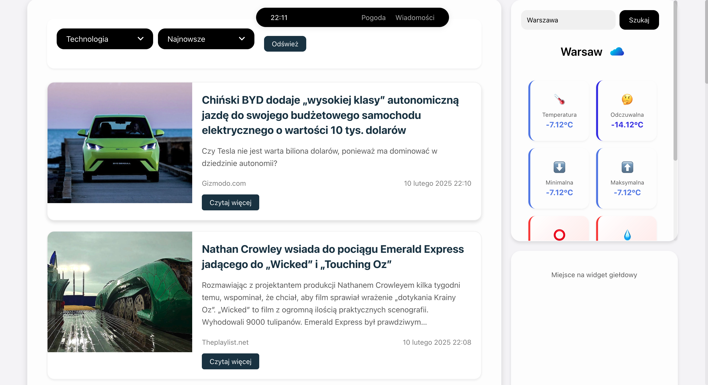

**Main page**

# News and Weather Web App

This repository contains a basic web application that fetches news in English, translates it to Polish using the Google Translate API, and displays it on the web page. Additionally, it fetches weather data based on coordinates and uses a geocoder API to convert city names to coordinates, which are then used to fetch the weather data.

## Features

- Fetches news in English and translates it to Polish using the Google Translate API.
- Displays translated news on the web page.
- Fetches weather data based on geographical coordinates.
- Uses a geocoder API to convert city names into coordinates.
- Displays weather information based on the coordinates.

## APIs Used

- **News API**: Fetches the latest news in English.
- **Google Translate API**: Translates the fetched news JSON data from English to Polish.
- **Weather API**: Fetches weather data based on coordinates.
- **Geocoder API**: Converts city names into geographical coordinates to be used by the Weather API.

## Technologies Used

- **Spring Framework**: Used for the backend of the application.
- **Artificial Intelligence**: The frontend is created for fun with the use of artificial intelligence.
